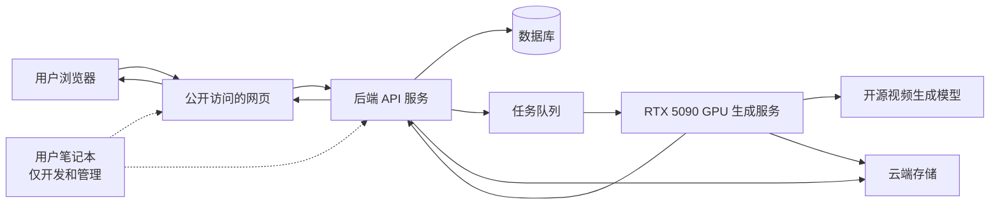

# 系统架构说明

本文说明 AI Video Platform 第一版的整体技术架构。当前仓库已经实现 Supabase 认证、积分读取、真实视频任务记录、积分扣除/退款、私有视频存储骨架和本地模拟 Worker，但仍不连接真实 GPU、支付或公网部署。

## 1. 总体思路

第一版系统分成 6 个主要部分：

- 前端网页：用户访问的网站页面。
- 后端服务：处理登录、积分、任务、视频历史记录。
- 数据库：保存用户、积分、任务和视频记录。
- 任务队列：把视频生成任务排队，避免网页请求一直等待。
- GPU 生成服务：运行在 RTX 5090 GPU 服务器上，负责真正生成视频。
- 云端存储：保存生成完成的视频文件。

用户笔记本只用于开发和管理，不作为公开服务器。

## 2. Mermaid 系统架构图

## 3. 各部分职责

### 前端网页

前端网页负责用户能看到和操作的部分：

- 注册页面。
- 登录页面。
- 积分余额显示。
- 提示词输入框。
- 提交生成按钮。
- 任务状态显示。
- 视频历史记录页面。

当前前端使用 Supabase 客户端读取登录状态、读取自己的积分和任务记录。创建任务不直接 `insert video_jobs`，而是调用数据库安全函数 `create_video_job`。取消任务也不直接 `update video_jobs`，而是调用 `cancel_video_job`。

前端不直接连接 GPU 服务器，不上传首帧图片，不写入视频输出地址，不修改任务状态或费用。成功任务播放时，前端通过服务端 API 请求短期签名 URL。

### 后端 API 服务

后端 API 服务是系统的核心协调者。

它负责：

- 处理注册和登录。
- 判断用户是否已登录。
- 查询用户积分。
- 检查积分是否足够。
- 创建视频生成任务。
- 把任务放入任务队列。
- 保存任务状态。
- 保存视频历史记录。
- 提供视频播放所需的信息。

后端不能把云服务密钥、数据库密码等写死在代码里。

当前阶段暂时没有单独的传统后端服务。业务边界主要由 Supabase Auth、RLS 和 PostgreSQL `security definer` 函数承担：

- `create_video_job(p_prompt, p_model_key)` 从 `auth.uid()` 取得当前用户，不允许客户端传 `user_id`。
- 函数内部固定任务状态为 `queued`，并按模型原子扣费。
- 函数限制同一用户最多 3 条 `queued` 或 `processing` 任务。
- `cancel_video_job(p_job_id)` 只允许用户取消自己的 `queued` 任务，并原子退款。
- Worker 函数只授权 `service_role`，普通用户不能调用。
- 浏览器客户端没有直接插入、更新或删除 `video_jobs` 的权限。

### 数据库

数据库保存结构化数据。

第一版至少需要保存：

- 用户表。
- 积分余额或积分流水。
- 视频生成任务表。
- 视频历史记录表。

数据库不适合直接保存大视频文件。视频文件应保存到云端存储，数据库只保存视频地址和相关信息。

当前已创建或规划的表：

- `profiles`：用户资料。
- `credit_accounts`：积分余额，注册时初始化 100 积分。
- `credit_transactions`：积分流水，包含 `generation_charge` 和 `generation_refund`。
- `video_jobs`：视频任务记录、进度、Worker lease、私有输出路径、扣费/退款时间。

### 任务队列

任务队列用于处理异步生成。

它的作用是：

- 接收后端提交的视频任务。
- 让任务按顺序等待处理。
- 避免用户网页请求长时间卡住。
- 方便 GPU 服务器逐个领取任务。

第一版可以选择简单成熟的队列方案，不需要复杂分布式架构。

当前使用数据库表作为简单队列。`claim_next_video_job` 使用 `for update skip locked` 原子领取最早的 queued 任务，避免多个 Worker 领取同一任务。

### GPU 生成服务

GPU 生成服务运行在线上 RTX 5090 GPU 服务器上。

它负责：

- 从任务队列领取任务。
- 调用一个开源视频生成模型。
- 生成固定 5 秒视频。
- 控制显存使用，目标是在 32GB 显存内运行。
- 上传生成后的视频到云端存储。
- 把成功或失败结果通知后端。

第一版只支持一个视频模型，不做自动扩缩容。

当前真实 GPU 尚未接入。`scripts/mock-video-worker.ts` 是本地模拟 Worker，会推进进度并上传程序生成的本地演示视频。`MOCK_WORKER_ONCE=true` 或 `npm run worker:mock:once` 可以让它只处理一条任务后退出。后续真实 RTX 5090 Worker 应复用同一组 service-role RPC，只替换“生成视频文件”的部分。

GPU Worker 部署准备阶段新增了受限身份方案：第三方 GPU 服务器不保存 Supabase Secret key 或 service_role key，而是用 Supabase Auth 登录专用 Worker 用户。`0005_limited_gpu_worker_role.sql` 会检查 JWT 中 `app_metadata.role = gpu_worker`，并继续保留 service_role 给本地管理和集成测试使用。

### 云端存储

云端存储用于保存视频文件。

它负责：

- 保存生成完成的视频。
- 提供网页播放所需的视频访问地址。
- 为未来下载功能做准备。

第一版规划阶段不连接真实云服务。

当前创建私有 `generated-videos` bucket。Worker 使用服务器 Secret key 上传 `user_id/job_id/output.mp4` 或 `.webm`。浏览器不能直接上传、删除或覆盖对象；用户只能读取自己路径下的视频，并且通过 15 分钟短期签名 URL 播放或下载。下载按钮会重新申请签名 URL，避免旧链接过期。

执行 0005 后，真实 GPU Worker 可作为受限 `gpu_worker` 用户上传自己已领取任务的 `user_id/job_id/output.mp4` 或 `.webm`。Storage 策略不允许 Worker 删除、列出无关路径或上传普通用户文件。普通用户上传仍然被禁止。

远程集成测试使用带唯一标识的临时 Supabase 用户、任务和 Storage 对象，并在 finally 中尽力清理。运行前会拒绝在已有 queued/processing 任务的项目中继续，以避免误领取真实任务。当前测试已经验证：账号认证初始化、积分扣除与退款、Worker 领取与防重复、心跳进度不倒退、失败退款、过期租约重排、最大尝试次数失败退款、私有 Storage 上传与跨用户隔离、短期签名 URL 播放/下载入口。

## 4. 推荐的简单成熟技术方向

以下只是规划方向，不代表已经安装或实现。

- 前端：选择主流 Web 框架，优先考虑生态成熟、部署方便的方案。
- 后端：选择简单稳定的 API 框架。
- 数据库：优先使用成熟关系型数据库，便于保存用户、积分和任务记录。
- 队列：第一版选择简单队列即可，不追求复杂集群。
- GPU 服务：独立部署在 GPU 服务器上，和公开网页服务分开。
- 文件存储：后续选择成熟云对象存储。

遇到不确定的技术选择时，优先采用简单、成熟、资料多、方便维护的方案。

## 5. 数据流说明

### 提交任务

1. 用户在网页输入文字提示词。
2. 前端调用 Supabase RPC `create_video_job`。
3. 数据库函数用 `auth.uid()` 检查用户是否登录。
4. 数据库函数校验提示词、模型、活跃任务数量。
5. 数据库函数锁定积分账户，检查余额，扣除积分。
6. 数据库函数创建任务记录，状态固定为 `queued`。
7. 数据库函数写入 `generation_charge` 流水。
8. 前端显示任务编号、排队中、扣除积分和最新余额。

取消 queued 任务或任务失败时，会写入唯一 `generation_refund` 流水并退还积分。

### 生成视频

1. GPU 生成服务从任务队列领取任务。
2. 后端或 GPU 服务把任务状态更新为生成中。
3. GPU 服务器运行开源视频生成模型。
4. 生成成功后，GPU 服务把视频上传到云端存储。
5. 系统保存视频地址，任务状态改为成功。
6. 如果生成失败，任务状态改为失败，并记录失败原因。

### 播放视频

1. 用户打开视频历史记录。
2. 前端向后端请求当前用户的视频列表。
3. 后端只返回该用户自己的视频记录。
4. 前端使用视频地址播放生成成功的视频。

## 6. 部署边界

第一版未来部署时应区分：

- 公开网页服务器：给用户访问。
- 后端 API 服务器：处理业务逻辑。
- GPU 服务器：只负责生成视频。
- 数据库和存储：使用受保护的服务。
- 用户笔记本：只用于开发、管理、上传代码、查看日志。

用户笔记本不能作为公开服务器，也不能暴露到公网承接用户访问。
